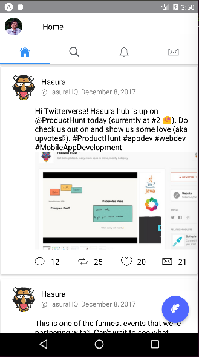
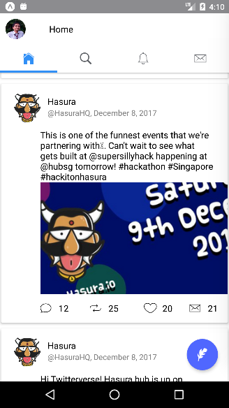
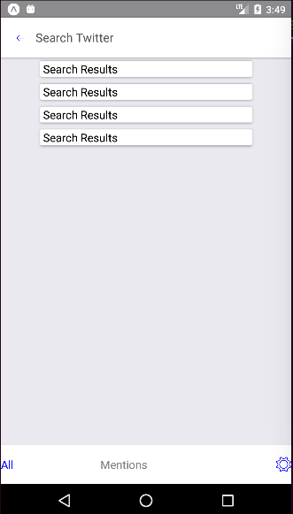
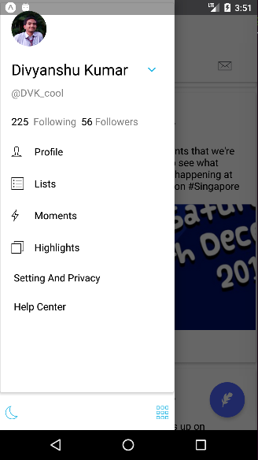
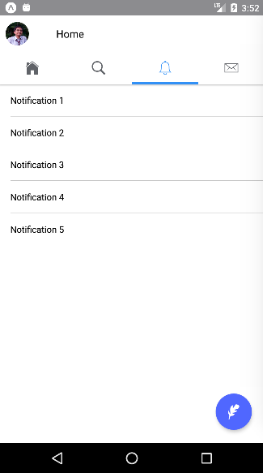
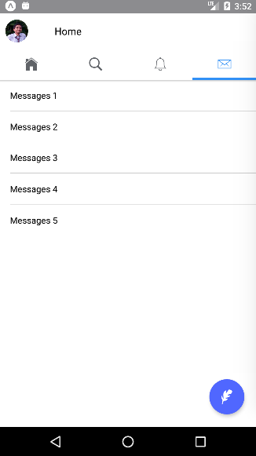

# Twitter Clone: HPDF Task1
This project is made for the fulfillment of task 1 of Hasura HPDF.

This is based on react-native, native-base and react-navigation libraries.


## Demo


  --|-- 
  --|-- 
  --|-- 

This projetc is based on [NativeBase](http://nativebase.io/) which is a free and open source framework that enables developers to build high-quality apps using [React Native](https://facebook.github.io/react-native/) for iOS and Android with a fusion of ES6.


## Get Started


#### 1. Installation

On the command prompt run the following commands

```sh
$ git clone git@github.com:dvkcool/twitterclone.git

$ cd twitterclone/

$ npm install

$ react-native link
```


#### 2. Simulate for Android or iOS

*	Make sure you have an **Android emulator** installed and running for Android and Xcode emulator for iOS.

*	Run the following command in your terminal.

```sh
$ sudo run yarn start
```
Then a command as following will display
```sh
› Press a to open Android device or emulator, or i to open iOS emulator.
 › Press q to display QR code.
 › Press r to restart packager, or R to restart packager and clear cache.
 › Press d to toggle development mode. (current mode: development)

```
Then enter your choice accordingly
a for Android and i for ios, Congratulations you have succefully setup this project.
#### 3. Notes
Also Notification and Message screen are not part of task, they are just implemented for a bit better feel.
For Drawer Slide the screen from Left to Right.
Tab scrolling is locked, so tabs can be changed by cicking on Tabs,
and Search screen a back button to return too, additionally back button of phone can be used.
Thank You, if you like the project, put on star on this repository.
